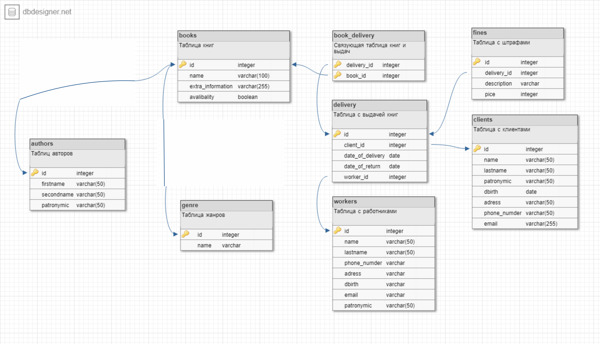

# База данных "Библиотека"
**Цель проекта**: проектирование базы данных для хранения и выдачи книг в библиотке

Код для создания таблиц базы данных "Библиотека" приведен в файле *tables_create.sql*.

### Описание таблиц
* **books** — таблица для книг (идентификатор, название, дополнительная информация, доступность).
* **books_authors** — связующая таблица книг и авторов (идентификатор книги, идентификатор автора).
* **books_deliverys** — связующая таблица книг и выдач (идентификатор книги, идентификатор выдачи).
* **clients** — таблица всех клиентов (идентификатор, имя, отчество, фамилия, номер телефон, электронная почта, дата рождения, адресс).
* **books_genres** — связующая таблица книг и жанров (иидентификатор книги, идентификатор жанра).
* **deliverys** — таблица заказов (идентификатор заказа, идентификатор книги, идентификатор работника, дата выдачи, дата возврата).
* **authors** — таблица всех авторов (идентификатор, имя, отчество, фамилия).
* **genres** — таблица всех жанров (идентификатор, название жанра).
* **workers** — таблица всех работников (идентификатор, имя, фамилия, отчество, номер телфона, адресс, почта, дата рождения)

### Описание связей между таблицами
* **books и authors**: "многие ко многим" (разные авторы могут писать разные книги). Для реализации связи создана связующая таблица book_authors.
* **books и genres**: "многие ко многим" (разные книги можно относить к разным жанрам). Для реализации связи создана связующая таблица book_delivery.
* **books и deliverys**: "многие ко многим" (разные книги могут быть в разных выдачах). Для реализации связи создана связующая таблица book_delivery.
* **clients и deliverys**: "один ко многим" (один клиент может сделать множество заказов).
* **deliverys и workers**: "один к одному" (одна выдача может проводится конкретным работником).
* **deliverys и fine**: "один к одному" (на один заказ - один пункт со описаниями штрафов). 

## Набор типовых данных для таблиц

Набор типовых данных для заполнения таблиц представлен в файле *typical_data.sql*.

## Примеры типовых операций
Примеры типовых операций представлены в файле *typical_operations.sql*.

#### Представления
       
       /*Представление с основной информациeй о заказе*/
          CREATE VIEW delivery_info 
          AS SELECT `deliverys`.id  as `delivery_id`,`clients`.firstname  as `client_name`, 
		  `clients`.lastname  as `client_lastname`, `books`.name as `book_name`, 
		  `workers`.lastname as `worker_lastname`
          FROM `clients`,`books`,`workers`,`deliverys`,`book_delivery` 
		  WHERE `deliverys`.id=`book_delivery`.delivery_id and `book_delivery`.book_id=`books`.id
		  and `clients`.id=`deliverys`.client_id and `deliverys`.worker_id=`workers`.id;

          SELECT * FROM delivery_info where delivery_id=1
          
       /*Представление с основной информациeй о книге*/
           CREATE VIEW book_info
	    AS SELECT `books`.id as `book_id`,`books`.name as `book_name`, GROUP_CONCAT(`genres`.name) as genres, 
		`authors`.firstname as `author_name`, `authors`.lastname as `author_lastname`, 
		`authors`.patronymic as `author_patronymic`, `books`.availability as `availability`
	     FROM `books`,`authors`,`book_authors`,`genres`,`book_genre` 
		 where `books`.id=`books_authors`.book_id and `books_authors`.author_id=`authors`.id
			and `books_genres`.book_id=`books`.id and `books_genres`.genre_id=`genres`.id
		GROUP BY `books`.id; 

          SELECT * FROM book_info WHERE `book_id`=1;
		  
       /*Представление с доступными книгами*/
          CREATE VIEW available_books
                    AS SELECT * 
                    FROM book_info where availability=1;

          SELECT * FROM available_books;
